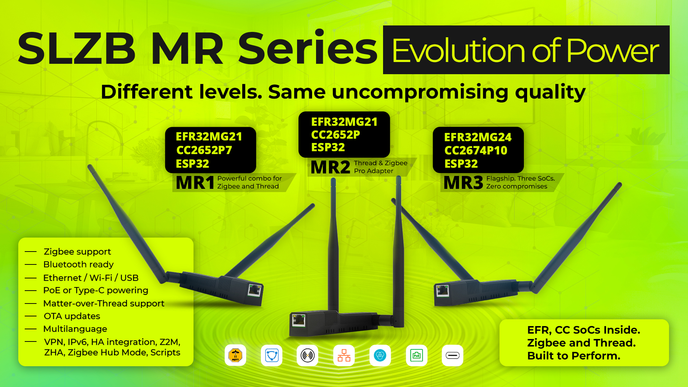

# SLZB Buying Guide

Optimisez votre Domotique Zigbee: Découverte du dongle PoE SLZB-06 pour Zigbee2mqtt et ZHA
https://www.domo-blog.fr/optimisez-domotique-zigbee-avantages-dongle-poe-slzb-06-zigbee2mqtt-zha/

## MR1, MR2, or MR3

### Chip Info

Reference: https://haade.fr/en/blog/efr32mg21-silabs-compatible-multiprotocol-zigbee-openthread-matter

#### CC2652P — Rank: 1

CC2652P (48 MHz, 88 KB RAM). Reliability tested over the years by many users. Fully supported in Zigbee2MQTT and ZHA — a universal coordinator. Supports up to 200 end devices. Even at max capacity, processor and RAM are not close to maximum utilization, so no speed difference vs other chips in the series. CC2652P is #1.

#### CC2652P7 — Rank: 2

CC2652P7 (48 MHz, 152 KB RAM). Same processor as CC2652P but more RAM. Neither processor nor memory exceeds 30% usage at max connected devices in coordinator mode. More of a marketing upgrade. Cheaper and more proven: CC2652P. Supports +20 dB gain at firmware level.

- https://www.ti.com/product/CC2652P7

#### EFR32MG21 — Rank: 1 (tied)

EFR32MG21 (80 MHz, 96 KB RAM). Similar specs to CC2652P. Ideal for ZHA (native HA coordinator uses the same chip). Listed as "experimental" in Zigbee2MQTT, but in practice shows more stable operation than CC26** in coordinator mode. Usually shows higher LQI with end devices despite both having +20 dB amplifiers.

- https://www.silabs.com/wireless/zigbee/efr32mg21-series-2-socs

#### EFR32MG24 — Rank: 3

EFR32MG24 (80 MHz, 256 KB RAM). Same as EFR32MG21 but with more RAM. Even at max connection, processor and RAM aren't fully loaded on the MG21 — so overpaying for MG24 is questionable.

- https://www.silabs.com/wireless/zigbee/efr32mg24-series-2-socs

#### CC2674P10 — Rank: 4

CC2674P10 (48 MHz, 264 KB RAM). Same processor as CC2652P/P7 but more RAM. Neither processor nor memory exceeds 30% at max load. Firmware is in test mode (as of Feb 2024) — buy at your own risk or for development purposes.

- https://www.ti.com/product/CC2674P10

### Decision

MR2 chip regression? https://www.reddit.com/r/homeassistant/comments/1l08o4i/which_to_get_slzbmr1_mr3/

Decision: go for **MR3** — not more expensive and more performant.

But customs duty from Ukraine: https://novapost.com/en-fr/international/receive-from-ukraine/ — can consider MR1 instead.

Price on AliExpress similar to Domadoo:
- https://www.domadoo.fr/fr/produits-de-domotique/7773-smlight-slzb-mr1-adaptateur-usb-ethernet-poe-zigbee-thread-matter.html
- https://fr.aliexpress.com/item/1005008814854495.html

> Note: MR series has one of SiLabs or TI chip, unlike 06 series (which has a single chip).

## MRW10

Also bought MRW10 with Z-Wave protocol support.

## Zigbee Accessories Purchased

| Price    | Item |
|----------|------|
| 18,02 €  | Tuya ZigBee 3.0 Smart Hub |
| 17,10 €  | MOES Tuya Zigbee 3.0 Smart IR Remote |
| 12,75 €  | MOES Tuya WiFi IR RF Remote |
| 11,09 €  | MOES Tuya Zigbee Smart Light Sensor |
| 8,47 €   | SONOFF SNZB-02P ZigBee Temperature Sensor |
| —        | ZigBee Smart Vibration Sensor |
| 6,35 €   | Rain Sensor Alert WiFi Zigbee |
| 4,19 €   | Tuya WiFi/Zigbee Temperature and Humidity Sensor |
| 12,75 €  | Tuya ZigBee Smart IR Remote Control |
| 14,52 €  | Haozee Tuya Smart Zigbee Rain Sensor |
| 6,58 €   | MOES Tuya ZigBee WiFi Smart IR Remote Control |
| 12,70 €  | UFO-R11 Zigbee Air Conditioner TV IR Remote |
| 12,14 €  | SONOFF SNZB-02D Zigbee Temperature Humidity Sensor |
